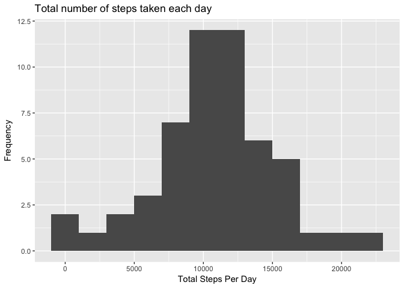
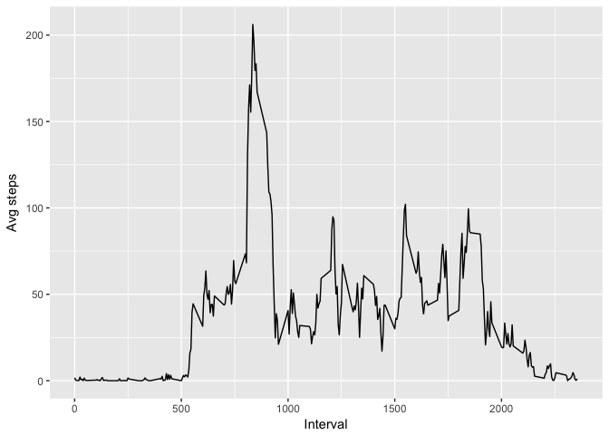
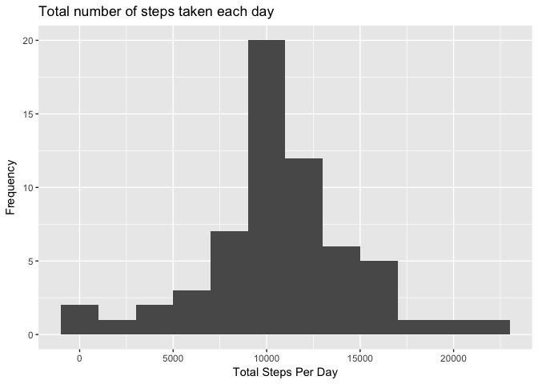
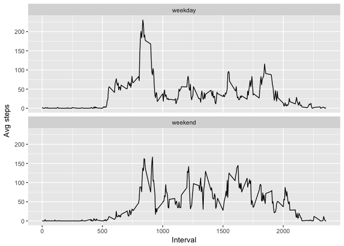

# Devoir noté par les pairs : Course Project 1


##Introdution
It is now possible to collect a large amount of data about personal movement using activity monitoring devices such as a Fitbit, Nike Fuelband, or Jawbone Up. These type of devices are part of the “quantified self” movement – a group of enthusiasts who take measurements about themselves regularly to improve their health, to find patterns in their behavior, or because they are tech geeks. But these data remain under-utilized both because the raw data are hard to obtain and there is a lack of statistical methods and software for processing and interpreting the data.

This assignment makes use of data from a personal activity monitoring device. This device collects data at 5 minute intervals through out the day. The data consists of two months of data from an anonymous individual collected during the months of October and November, 2012 and include the number of steps taken in 5 minute intervals each day.

The data for this assignment can be downloaded from the course web site:

* The dataset can be downloaded from [here](https://d396qusza40orc.cloudfront.net/repdata%2Fdata%2Factivity.zip)
and must be saved inside your **Working Directory**

##Loading and preprocessing the data
File header is

 * steps: number of steps
 
 * date: date
 
 * interval: 5 minute interval starting from 0 ending to 2355
 
###Loading the data

1. Load libraries and settings

```r
library(stringr)
library(ggplot2)
```

2. Load the data from the Working Directory


```r
df <-
        read.table(
          'activity.csv',
          header = TRUE,
          sep = ",",
          na.strings = "NA",
          colClasses = c("integer", "character", "integer")
        )
```
3. Transform date column in a Date class

```r
df$date <- as.Date(df$date, format="%Y-%m-%d")
```
4. Data sample

```r
head(df)
```

```
##   steps       date interval
## 1    NA 2012-10-01        0
## 2    NA 2012-10-01        5
## 3    NA 2012-10-01       10
## 4    NA 2012-10-01       15
## 5    NA 2012-10-01       20
## 6    NA 2012-10-01       25
```


<!--    Process/transform the data (if necessary) into a format suitable for your analysis -->

##What is mean total number of steps taken per day?

<!--For this part of the assignment, you can ignore the missing values in the dataset. -->

###Calculate the total number of steps taken per day
<!--If you do not understand the difference between a histogram and a barplot, research the         difference between them. -->


1. Aggregate Steps by day

```r
dailySteps<-aggregate(steps ~ date, data = df, FUN = sum,na.action=na.pass)
```
    
2. Calculate and report the mean of the total number of steps taken per day
    

```r
stepMeanNA <- mean(dailySteps$steps, na.rm = TRUE)
stepMeanNA
```

```
## [1] 10766.19
```

3. Calculate and report the median of the total number of steps taken per day

```r
stepMedianNA <- median(dailySteps$steps, na.rm = TRUE)
stepMedianNA
```

```
## [1] 10765
```
4. Make a histogram of the total number of steps taken each day


```r
#ggplot(dailySteps, aes(x = date, y = steps)) + geom_histogram()

ggplot(dailySteps, aes(steps)) + geom_histogram(binwidth = 2000, na.rm = TRUE) + labs(title = "Total number of steps taken each day", x = "Total Steps Per Day", y = "Frequency")
```

<!-- -->


##What is the average daily activity pattern?

1. Compute the average number of steps taken by time intervale

```r
intervalSteps<-aggregate(steps ~ interval, data = df, FUN= function(z) mean(z, na.rm = TRUE) ,na.action=na.pass)

head(intervalSteps)
```

```
##   interval     steps
## 1        0 1.7169811
## 2        5 0.3396226
## 3       10 0.1320755
## 4       15 0.1509434
## 5       20 0.0754717
## 6       25 2.0943396
```

2. Make a time series plot (i.e. type = "l") of the 5-minute interval (x-axis) and the average number of steps taken, averaged across all days (y-axis)


```r
ggplot(intervalSteps, aes(x = interval, y = steps)) + geom_line(stat =
"identity") +
labs(x = "Interval", y="Avg steps") 
```

<!-- -->

3. Which 5-minute interval, on average across all the days in the dataset, contains the maximum number of steps?


```r
intervalSteps[which.max(intervalSteps$steps),]
```

```
##     interval    steps
## 104      835 206.1698
```
##Imputing missing values

**Note that there are a number of days/intervals where there are missing values (coded as NA). The presence of missing days may introduce bias into some calculations or summaries of the data.**

1. Calculate and report the total number of missing values in the dataset (i.e. the total number of rows with NAs)

```r
sum(!complete.cases(df))
```

```
## [1] 2304
```
2.  The devised strategy for filling in all of the missing values in the dataset will be to take the mean of a 5 minute interval. Hence, we will create a new dataset that is equal to the original dataset but with the missing data filled

```r
dfNotNa<-df

for (i in which(!complete.cases(dfNotNa))) {dfNotNa[i,]$steps<-intervalSteps[intervalSteps$interval==dfNotNa[i,]$interval,]$steps}
```

###    Make a histogram of the total number of steps taken each day and Calculate and report the mean and median total number of steps taken per day. Do these values differ from the estimates from the first part of the assignment? 
    
    
1. Aggregate Steps by day

```r
dailySteps<-aggregate(steps ~ date, data = dfNotNa, FUN = sum,na.action=na.pass)
```
    
2. Calculate and report the mean of the total number of steps taken per day
    

```r
stepMean <- mean(dailySteps$steps, na.rm = TRUE)
stepMean
```

```
## [1] 10766.19
```

3. Calculate and report the median of the total number of steps taken per day

```r
stepMedian <- median(dailySteps$steps, na.rm = TRUE)
stepMedian
```

```
## [1] 10766.19
```
4. Make a histogram of the total number of steps taken each day


```r
ggplot(dailySteps, aes(steps)) + geom_histogram(binwidth = 2000, na.rm = TRUE) +
  labs(title = "Total number of steps taken each day", x = "Total Steps Per Day", y = "Frequency")
```

<!-- -->

###What is the impact of imputing missing data on the estimates of the total daily number of steps?
**as one can notice mean and median values changes slightely compared to uncleaned data set**

Mean with NA

```r
stepMeanNA
```

```
## [1] 10766.19
```
Mean without NA

```r
stepMean
```

```
## [1] 10766.19
```

Median with NA

```r
stepMedianNA
```

```
## [1] 10765
```
Median without NA

```r
stepMedian
```

```
## [1] 10766.19
```

##Are there differences in activity patterns between weekdays and weekends?

<!--For this part the weekdays() function may be of some help here. Use the dataset with the filled-in missing values for this part. -->

1. Create a new factor variable in the dataset with two levels – “weekday” and “weekend” indicating whether a given date is a weekday or weekend day. I added a second variable with the name of the day for checking purpose


```r
dfNotNa<- cbind(dfNotNa, day = weekdays(dfNotNa$date))
#weekdays() causes trouble if the locale is not set to English
dfNotNa<- cbind(dfNotNa, daytype = ifelse(as.POSIXlt(df$date)$wday%in% c(0,6),"weekend","weekday"))

head(dfNotNa)
```

```
##       steps       date interval   day daytype
## 1 1.7169811 2012-10-01        0 Lundi weekday
## 2 0.3396226 2012-10-01        5 Lundi weekday
## 3 0.1320755 2012-10-01       10 Lundi weekday
## 4 0.1509434 2012-10-01       15 Lundi weekday
## 5 0.0754717 2012-10-01       20 Lundi weekday
## 6 2.0943396 2012-10-01       25 Lundi weekday
```

2. Aggragate value by interval and day type

```r
intervalSteps<-aggregate(steps ~ interval+daytype, data = dfNotNa, mean ,na.action=na.pass)

head(intervalSteps)
```

```
##   interval daytype      steps
## 1        0 weekday 2.25115304
## 2        5 weekday 0.44528302
## 3       10 weekday 0.17316562
## 4       15 weekday 0.19790356
## 5       20 weekday 0.09895178
## 6       25 weekday 1.59035639
```

3. Make a panel plot containing a time series plot (i.e. type = "l") of the 5-minute interval (x-axis) and the average number of steps taken, averaged across all weekday days or weekend days (y-axis).


```r
ggplot(intervalSteps, aes(x = interval, y = steps)) + geom_line(stat =
                                                                  "identity") + facet_wrap( ~ daytype, ncol = 1) +
                                                                  labs(x = "Interval", y = "Avg steps") 
```

<!-- -->

<!--See the README file in the GitHub repository to see an example of what this plot should look like using simulated data. -->

